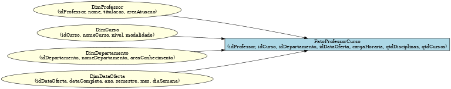

# 📊 Projeto de Modelagem Dimensional – Esquema Estrela

## 📌 Objetivo
Este projeto tem como objetivo a construção de um **modelo dimensional (Star Schema)** com foco na **análise de professores**, a partir de um diagrama relacional previamente fornecido.

---

## 🏗️ Estrutura do Modelo

### 🔹 Tabela Fato
**FatoProfessorCurso**  
- idProfessor (FK)  
- idCurso (FK)  
- idDepartamento (FK)  
- idDataOferta (FK)  
- cargaHoraria  
- qtdDisciplinasMinistradas  
- qtdCursosMinistrados  

### 🔹 Tabelas Dimensão
**DimProfessor**  
- idProfessor (PK)  
- nomeProfessor  
- titulacao  
- areaAtuacao  

**DimCurso**  
- idCurso (PK)  
- nomeCurso  
- nivel (graduação, pós)  
- modalidade (presencial, EAD)  

**DimDepartamento**  
- idDepartamento (PK)  
- nomeDepartamento  
- areaConhecimento  

**DimDataOferta**  
- idDataOferta (PK)  
- dataCompleta  
- ano  
- semestre  
- mes  
- diaSemana  

---

## 🎯 Granularidade
A granularidade escolhida foi **curso ministrado por professor em determinado departamento e período**.  
Essa abordagem permite análises detalhadas sobre a carga horária, disciplinas e cursos atribuídos a cada professor.  

---

## 🖼️ Diagrama Estrela
A seguir, o esquema estrela construído:  

---

## ✅ Conclusão
Este modelo facilita a construção de relatórios e dashboards, pois organiza os dados de forma clara e otimizada para análises.  
A separação em dimensões permite cruzar informações de professores, cursos, departamentos e tempo, possibilitando insights relevantes para a gestão acadêmica.
